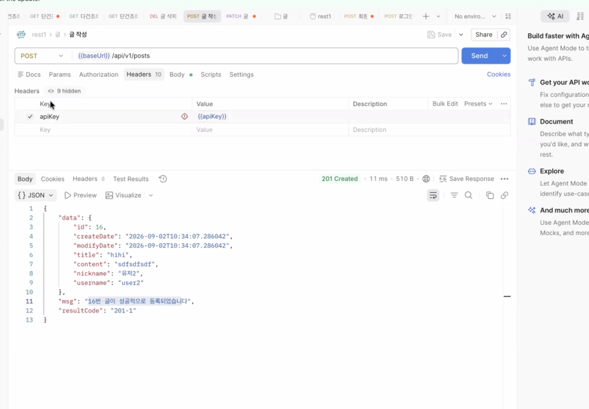

------------------------------------------------------------------------------
# 2026.09.01 (1-14)
------------------------------------------------------------------------------
==============================================================================
# 1부 - ApiKey 종료
==============================================================================

## 2강, 회원 도메인 도입하고 샘플 데이터 5명 생성
인증 -> 넌 누구? 신원확인
인가 -> 너가 해도 되는 거야? 권한 확인
mkdir domain/member에서 repo, entity, service 만들고 baseinit data 추가

## 3강, 글과 댓글에 작성자 등록. 작성자는 임의로 user1로 설정. self.work2() 호출 누락된 것 추가
Option형 findByYsername을 맴버 레포에 구현
!-Post가 N 쪽이니까 ManyToOne을 작성해야 한다.
  ManyToOne은 필수이다. 그리고 왜래키를 가지고 있는 쪽이 Many이다.
  fetch 를 LAZY로 설정하면 포스트만 가져오고 member가 필요한 시점, 그 시점에 가져온다. 
  안 가져왔다면 시작부터 member도 가져왓을 거임. 

## 4강, postDto에 작성자 정보 authorId와 authorName 추가. 글 작성 시 author 연결 누락된 부분 수정
!-개발할 때 위험한 방법은 나중에 사용하지 않을까 싶어서 개발하는 것이 위험한 습관이다

## 5강 - DTO에는 꼭 필요한 데이터만 담는다. 최소공개원칙
필요한 거 당므셔라 이 얘기입니다.

## 6강, CommentDto에도 작성자 정보 추가, postId도 같이 추가
넘어가시구요

## 7강, Dto의 스펙이 바뀌면 원래 테스트 케이스부터 고쳐야 하지만 일단은 Dto 수정하고 테스트에 반영
7강은 방금 위(4강)에서 같이 테스트 케이스 작성한 겁니다.

## 8강, username 파라미터를 입력 받아 작성자가 누구인지 스프링부트가 알게 함

## 9-10강,비밀번호까지 입력받아서 사칭을 못하게 막고, 예외를 상세하게 처리하는 것은 좋지만 너무 방대하다. 우리 서비스에 맞는 ServiceException 도입
MisMatchHandlerException구현했다. 그럼에도 예외 케이스는 매우 많다. 로그인을 싪패하는 이유만 해도 
아이디 오류, 비밀번호 오류, 블랙리시트, 인증 대기 등이 있다. 정말 정성껏 하고 싶다면 이 예외들을 만드는 방법이 있다. 
원리 이를 클래스를 하나씩 만드는 게 정석이긴 하다. 로그인만 해도 많은데 예외에 대한 클래스를 하나하나 만들면 귀찮다. 그래서 이렇게 할 수 있다 라는
걸 알아만 두고, 우리는 프로젝트의 규모가 너무 크지 않고, 어떤 예외 케이스가 핵심적이고 얘네들을 섬세하게 다룰 필요가 없는데 클래스를 하나하나 
구현하는 것은 오버엔지니어링이다. 따라서 서비스/도메인 예외로 퉁치긴 한다. 하나로 통일해 구체적인 응답 코드와 메시지로 처리한다. 이 장점은
일단 편하다. 내가 개발을 할 때 편하다. 일단 이거로 가고 꼭 필요한 부분만 위처럼 도입하는 것이 좋다. 그래서 우리는 일단 방금 구현한 예외 삭제함.
그래서 모든 예외를 공유할 걸 global/exception/ServiceException에 만들 것이다. 이 ServiceException은 우리가 만든 예외고,
우리가 만든 예외를 사용할 수 있다.

## 11강, 보고서 양식 문제는 해결. 인증 데이터가 문제. 일단 문제점 인지
서버 -> REST API -> 무상태성(stateless) 추구
클라이언트에 인즈 ㅇ정보 저장 -> 불안 0> 서버에 저장 -> 무상태성 위반 -> 프론트 -> JTW

프론트에서 인증 데이터로 ID / PW를 넘김
-> ID-PW:매우 민감함 데이터

인증데이터를 좀 더 무의미하고 무작위한 값으로 하자 -> apiKey라고 명명하겠습니다.
apiKey는 어떤 유의미한 값이 있어서는 안 되고 무작위 해야 한다.

## 12강,  회원에게 apiKey 추가, username과 apiKey에 유니크 설정 추가
@Column(unique = true)

## 13강, 이제 글 작성시 username/password가 아니라 apiKey로 인증

## 14강, TDD 방식으로 ApiV1MemberController 구현. 테스트 유저 데이터는 {"newUser", "1234", "새유저"}

* 오늘까지 체크 포인트는 아이디 비밀번호 대신 apikey를 만드는 방법이 있다.
---

------------------------------------------------------------------------------
# 2026.09.02 (14-26)
------------------------------------------------------------------------------
# 15강, 회원 가입시 중복된 아이디 처리, 테스트 케이스 먼저 만들고 구현
* commit message - test: check for already exist username
* commit message - feat(member): implement ApiV1MemberController 

## 16강, username 중복 처리 로직을 memberService로 옮겨서 재사용성을 높임
* commit message - 


## 17강, 로그인 기능 구현
* commit message -
 인증 != 로그인입니다.
 인증이라는 건 어떤 수단을 가지고 이 api를 사용하는 사람에게 인증을 요구하는 것이다. 너임을 증명해라. 
 그리고 그림을 그려줌.
 제 API키인데 다른 유저에게 사용하도록 보내
 인증테이터가 필요하다면 최초로 한 번은 인증 데이터가 필요하다고 보내야합니다. 그래서 로그인이라는 것은 인증 데이터를 달라고 하는 행위이지 인증은 아닙니다. 
 이 인증 데이터를 확보를 하는 행위로 확보된 데이터를 통해 인증을 할 겁니다 앞으로.
 dto를 만들 땐 외부까지 가실 걸 생각해 보고 프론트로 갈 건 위험해 질 수도 있기 떄문에 민감한 정보는 프론트에 가지 않게 해야함. 그래서 apikey를 dto에 넣지 않겠다.
 따라서 dto와 apikey를 따로 전달할 것이다.
선택이 갈린다 여기서. 조인이랑 로그인 둘 다 포스트를 쓰게 되면서 충돌이 난다. 그래서 우리는 이걸 해결해야 한다. 
 
** 코드 복붙**

1. 컨트롤러 분리
- 회원가입: 단순 회원 기능
- 로그인: 회원 인증 기능

2. 동사를 사용 
- POST/api/v1/members/join: 회원가입
- POST/api/v1/members/login: 로그인
-> RESTFUL하지 않다. 동사를 사용하지 않다는 게 규칙이었다.
정말 점격하게 규칙을 따르고 싶다면 1번을 따르는 게 맞다.
웬만해서 RESTFUL하게 가는 게 맞지만 백과 프론트의 우리(같은 사람)의 통제 하에 있다.

개발 방법론 ex TEST API, 디자인 패턴 등을 너무 맹신하지 않는 것이 좋다. 
우리의 목표가 있다면 그 목표에 맞는 방법론을 사용하는 게 좋다. 예컨데 RESTFUL을 사용하지 않는 게 좋다. 왜 이렇게 했냐고 했을 때 이유를 말해주는 것이 좋다.rstful하게

구현은 같이 해보는 것이 좋을 것 같아서 해봄

여기를 거의 1시간을 설명했음

## 18강 1부, 콜렉션에 baseURL 변수 지정하고 각 요청에 활용, 2부, POSTMAN에서 콜렉션 변수 apiKey 만들어서 사용
* commit message -

*  잠깐 이전 설명 복습
로그인을 하고 나면 apikey만 가지고 클라이언트와 서버가 소통할 수 있다
그리고 서버에만 저장하는 순간 무상태성을 위반하는데 프론트에 저장하면 위험하긴 하다.
그래서 아이디 비번 보다는 apikey를 프론트에 저장한다. -> 뭔소리일까?

## 19강, 1부, apiKey를 header에 Authorization으로 보내기. 2부-Authorization 헤더를 백엔드에서 처리
* commit message - refactor(member): handle API key from Authroization header
 현재 인증데이터(apiKey)가 url 파라미터로 넘어가고 있음.
 갑자기 body로 apikey를 넘김. (Postman에서)
 request param이아니라 postwritereqbody에서 string apikey로 바꾸는데? 
 아 바디에 포함시키는 거구나
 url에 포함: 위험
 body에 포함: 근데 BODY에 포함시키면 안 좋은 점도 있따. GET 요청은 requestBody가 없다. 그래서 하나의 방법이긴 하지만 제약이
있기 때문에 보통 body에 포함하진 않는다.
 header에 포함: 모든 요청에 헤더는 필수 존재.
 따라서 인증데이터는 header에 넣는 것이 좋다.
 Postman의 header탭에 들어가서 apikey를 넣음

## 20강, 포스트맨에서 최상위 부모에게 auth type을 설정하면 자식들이 설정을 물려 받음. 이제 Authorization 헤더를 직접 넣지 않아도 된다.
* 포스트맨만 사용
이제 포스트맨에서 처리해야 하는 부분은 끝났습니다.

## 21강, 글 수정시에도 인증정보를 전달, 글 수정시 권한체크(인가)까지 진행
* test(member): set sample API keys to match usernames
인증 -> 누구인지 증명
인가 -> 누군지는 알겠고 권한이 있나 체크
 
member에 생성자 추가


## 22강, 글 삭제 인증과 권한 처리
feat(post): add authentication and authorization for post deletion
* 구체적으로는 Authorization: Bearer ... 헤더에서 API Key를 추출하고, 유효하지 않은 키는 401, 작성자가 아닌 사용자의 삭제 요청은 403으로 차단했습니다. 기존 글 작성/수정 요청의 Authorization 헤더에도 @NotBlank 검증을 추가했고, 관련 테스트에도 인증 헤더를 추가했습니다.


## 23강, 글 등록 테스트케이스에도 인증과권한 내용 추가
글쓰기에서 글 내용과 제목은 삭제 요청에서는 씆 ㅣ않죠? 글쓰기엣머ㅏㄴ 유효한 건 거기서 쓰고 삭제해야 한다.

그래서 우리가 만드는 rq 클래스느 새로운 요청이 들어오면 그 요청에 맞게 만들어 지고 요청에 대한 처리가 끝나면
rq도 필요가 없기에 사라져야 한다.
됴청을 100번 했다 -> Rq가 100개 만들어진다.

## 24강 1부, 테스트 케이스 메서드명 순서 조정, Rq 클래스 도입 2부, Rq는 요청마다 생성되고 사라져야 한다. @RequestScope 적용
## 25강, 컨트롤러에서 중복되는 인증 로직을 rq로 옮기는 리팩토링.
이 중복 코드를 새로 만든 Rq 클래스의 한 줄로 대체했습니다.
 즉, HTTP 요청에서 인증 정보를 꺼내 현재 로그인 사용자를 구하는 책임을 컨트롤러에서 Rq로 분리한 것입니다.
 따라서 Rq 객체는 애플리케이션 전체에서 하나를 공유하는 Singleton이 아니라 
 HTTP 요청 하나마다 하나씩 생성되고 요청이 끝나면 사라집니다. 요청마다 달라지는 
 HttpServletRequest나 현재 사용자 정보를 다루는 객체에 적합한 생명주기입니다.
**가장 중요한 개념은 인증(Authentication)과 인가(Authorization)의 분리입니다.**

Rq에는 @RequestScope가 붙었습니다.

## 26강,

------------------------------------------------------------------------------------
## 2026.09.03 (27-48)
------------------------------------------------------------------------------------
# 27강, 리팩토링, 글 권한체크 로직을 컨트롤러가 아닌 엔터티로 옮기기
글 수정 
위키 0> 내 글을 남이 수정 ok
블로그 0> 내 글을 남이 수정 no
비즈니스/도메인 규칙 -> 엔터티 -> 서비스 => 서비스 파사드 

Controller: 요청을 받고 흐름을 연결
Post Entity: 이 사용자가 해당 글을 수정/삭제할 권한이 있는지 판단

하도록 책임을 분리한 것입니다.

이렇게 하면 권한 규칙이 컨트롤러에 흩어지지 않고 게시글 자체의 도메인 규칙으로 응집됩니다. 나중에 다른 곳에서 글 수정/삭제를 호출해도 같은 권한 검증 로직을 재사용할 수 있다는 장점이 있습니다.

post에 커서를 올리며 자기가 가지고 있는 건 자기가 처리하는 게 좋다고 함.

## 28강, , 글 작성 인증 관련 예외 케이스를 테스트케이스에 추가
개인적으로 하고 넘어가는 거로 하겠습니다.

## 29강, 글 수정·삭제 권한 체크 테스트 케이스 추가 및 테스트 작성 기준 정리

## 30강, 댓글 기능에도 인증·인가 적용 및 테스트 케이스 추가, 사소한 버그 수정

## 31강, 내 정보 API 구현 및 테스트
갑자기 여기?
==============================================================================
# 1부 - ApiKey 종료
==============================================================================


==============================================================================
# 2부 - Cookie시작
==============================================================================
## 32강, apiKey 저장 방식으로 localStorage와 Cookie 비교, localStorage를 이용한 반영구적 저장
 * 인증 정보는 모든 요청마다 추가해야 한다.

 apiKey를 로컬 스토리지에 저장하는 이유
  * 브라우저를 다시 시작해도 로그인 상태가 유지됨
  * 다른 페이지로 이동했다가 돌아와도 로그인 상태가 유지됨
  * 일반 변수에 저장하면 브라우저를 다시 시작하거나 페이지를 이동할 때마다 로그인을 다시 해야 함
  * 로컬 스토맂는 브라우저의 저장소에 데이터를 안전하게 보관해주는 기능

## 33강, XSS 공격 개념 및 간단한 공격 예시
 * XSS란
   * Cross Stie Scripting의 약자
   * 앱 애플리케이션에서 일어나는 취약점
   * 관리자가 아닌 권한이 없는 사용자가 웹 사이트에 스크립트를 삽입하는 공격기법
   * 공격자가 웹 페이지에 악성 스크립트를 삽입하여 다른 사용자의 정보를 탈취하거나 비정상적인 기능을 수행하게 함

## 34강, Thymeleaf와 React의 기본 XSS 방어 방식
 * 타임리프나 리액트에서는 기본적으로 XSS 공격에 대한 방어가 되어 있다.
 * 타임리프 XSS 공격 방어
  `<p th:text="${content}"></p>`
 * 타임리프 XSS 공격 방어 안함
   `<p th:utext="${content}"></p>`
 * 리액트 XSS 공격 방어
   `<p>{content}</p>`
 * 리액트 XSS 공격 방어 안함 
   `<p dangerouslySetInnerHTML={{ __html: content }}></p>`

XSS 방어를 일부러 하지 말아야 하는 부분도 있다.
 * 예를들면 게시물 글 본문
 * 사용자가 작성한 글에 굵은 글씨, 기울임체, 색상 변경 등의 스타일을 적용하고 싶을 때
 * HTML 태그를 사용해서 글을 예쁘게 꾸미고 싶을 때
 * 이런 경우에는 XSS 방어를 일부러 끄고 HTML 태그가 실행되도록 해야 함
 * 하지만 이는 매우 위험하므로 신중하게 사용해야 함

## 35강, React에서 XSS 방어를 해제해야 하는 경우
아래는 예시 코드
```
console.clear();
import React, { useState } from "https://esm.sh/react@rc?dev";
import ReactDOMClient from "https://esm.sh/react-dom@rc/client/?dev";
const rootElement = ReactDOMClient.createRoot(document.getElementById("root"));

function App() {
  const content = `<div>
  안녕하세요
  좋은 아침입니다.
  오늘 하루도 힘내봅시다!
  <br>
  
</div>`;
  return <p dangerouslySetInnerHTML={{ __html: content }}></p>;
}
rootElement.render(<App />);
```

## 36강, apiKey 탈취 시나리오 정리

## 37강, Cookie는 fetch 요청 시 자동으로 헤더에 포함됨키 vs 로컬 스토리지 비교
구분	쿠키	로컬 스토리지
프론트엔드에서 조작 가능	✅ 가능	✅ 가능
백엔드에서 조작 가능	✅ 가능 (Set-Cookie 헤더)	❌ 불가능
fetch 시 자동 전송	✅ 자동으로 전송됨 (Cookie 헤더)	❌ 수동으로 전송해야 함
용량 제한	4KB	5-10MB
만료 기간	설정 가능	영구 보존
도메인 제한	설정 가능	도메인별 분리
XSS 보안	HttpOnly 플래그를 설정하면 클라이언트에서 접근 불가	클라이언트에서 자유롭게 접근 가능

## 38강, Cookie와 localStorage 비교

## 39강, Cookie 설정·전송 테스트 및 도메인 변조 등 웹 레벨 밖 공격의 한계

## 40강, Cookie와 Authorization 헤더 혼합 방식 사용

## 41강, 로그인 요청 시 apiKey 쿠키 생성을 위한 테스트 케이스 작성

## 42강, 로그인 시 apiKey 쿠키 생성

## 43강, 응답 쿠키 생성 로직을 Rq로 이동
* refactor(auth): move cookie response handling to Rq
로그인 컨트롤러에서 직접 HttpServletResponse를 받아 쿠키를 추가하던 로직을 Rq로 이동함.
Rq가 HttpServletRequest뿐 아니라 HttpServletResponse도 가지게 되면서, 요청/응답과 관련된 공통 처리를 Rq에 모으는 구조가 됨.
컨트롤러는 HTTP 세부 구현을 직접 다루지 않고, 로그인이라는 비즈니스 흐름에 더 집중하게 됨.
핵심 개념은 관심사 분리(Separation of Concerns)와 중복 HTTP 처리 로직의 캡슐화.

## 44강, Cookie 세부 설정 적용 및 테스트
이번 커밋은 로그인 시 생성하는 apiKey 쿠키에 세부 속성을 지정하고, 그 설정까지 테스트하도록 강화한 작업입니다.
 path=/, httpOnly=true, domain=localhost
Path=/ → 애플리케이션의 모든 경로 요청에 쿠키가 전송됩니다.
Domain=localhost → 해당 도메인에서만 쿠키를 사용합니다.
HttpOnly=true → JavaScript의 document.cookie로 접근할 수 없게 하여 XSS로 인한 인증정보 탈취 위험을 줄입니다.
테스트에서도 단순히 쿠키 존재 여부만 보는 것이 아니라 path, domain, httpOnly 값까지 검증하도록 변경했습니다.

## 45강, 인증 시 Authorization 헤더와 Cookie 헤더 모두에서 인증 정보 조회

## 46강, 개발 편의를 위해 샘플 회원 5명의 apiKey를 username과 동일하게 설정

## 47강, 로그아웃 구현 및 HttpOnly 쿠키 삭제 처리
로그아웃 API를 구현하고, 로그인 때 생성한 HttpOnly apiKey 쿠키를 서버에서 만료시키는 작업입니다.

## 48강, OpenAPI 문서에 @SecurityScheme를 추가해 헤더 기반 인증 기능 적용
이번 커밋은 Swagger/OpenAPI 문서에서 Bearer 인증을 사용할 수 있도록 보안 스키마를 등록한 작업입니다.

==============================================================================
# 2부 : HttpOnly Cookie 종료
==============================================================================


------------------------------------------------------------------------------
# 2026.09.03 (49-)
------------------------------------------------------------------------------
==============================================================================
# 3부 : JWT 시작
==============================================================================
# 49강, apiKey 방식은 그것이 유효한지 확인하기 위해서는 꼭 DB 조회가 필요하다 이게 나쁘지는 않지만 더 좋은 방식이 있다

# 50강, apiKey 방식은 그것이 유효한지 확인하기 위해서는 꼭 DB 조회가 필요하다 이게 나쁘지는 않지만 더 좋은 방식이 있다
* 이번 커밋은 JWT 기반 인증 토큰 처리를 시작하기 위한 초기 구조를 만든 작업입니다. 아직 JWT 생성/검증 로직 자체는 구현되지 않았습니다.

## 51강, JWT는 signature를 이용해 위조 방지 가능
* 커밋 없음

## 52강, JWT 토큰 생성 테스트 케이스 작성
* test(auth): add JWT token generation test

## 53강, Ut.jwt.toString 함수를 이용해 JWT 생성
* feat(auth): add JWT generation utility

## 54강, AuthTokenService.genAccessToken 함수 구현
apiKey 사용할 때 
-> apiKey로 인증 성공한다고 하더라도 이 사람이 누군지 모름
-> apiKey = 회원정보 칼럼을 만들ㅇ러서 이런 식으로 매핑을 해놨기 떄문에 db조회를 할 수밖에 없다.

JWT를 사용할 때
-> 회원 정보가 jwt에 내포될 수 있으므로 db 조회가 필요 없다.

## 55강, JWT 유효성 체크 및 payload 추출

## 56강, Ut.jwt.isValid 함수로 JWT 유효성 검증 구현

## 57강, Ut.jwt.payload 함수 구현

## 58강, AuthTokenService에 payload 함수 도입

## 59강, JWT secretPattern과 expireSeconds를 application.yml에서 관리

## 60강, 로그인 후 Access Token 발급 구현

## 61강, Rq.getActor에서 Access Token을 우선 사용하도록 인증 로직 수정

## 62강, JWT 인증 구조와 동작 원리 정리

## 63강, Access Token 탈취 위험과 짧은 만료시간이 필요한 이유

## 64강, Refresh Token이 필요한 이유

## 65강, Access Token과 Refresh Token 비교

## 66강, apiKey가 유효하지 않아도 Access Token이 유효하면 인증 성공하도록 구현

## 67강, Access Token 인증에서 DB 조회가 발생하는 문제 확인

## 68강, JPA 조회 없이 Access Token으로 Member 객체를 생성해 빠른 인증 구현

## 69강, Access Token claims에 nickname 추가

## 70강, JWT claims 크기와 정보 표현·쿼리 최적화의 관계

## 71강, 내 정보 API처럼 실제 회원 정보가 필요한 경우 DB 조회

## 72강, 유효하지 않은 Access Token을 재발급해야 하는 이유

## 73강, Access Token이 유효하지 않으면 apiKey를 이용해 재발급

## 74강, 만료된 Access Token의 실제 재발급 동작 확인

## 75강, Access Token 자동 재발급 방식과 Refresh Token 만료 정책 정리

## 76강, 관리자용 회원 다건 조회 API 구현

## 77강, 회원 다건 조회 API에 관리자 권한 접근 제한 적용

## 78강, 글 통계 기능 API 구현

## 79강, Spring Security 도입 및 기본 동작 이해

## 80강, SecurityConfig 설정으로 요청 허용, H2 Console 허용 및 CSRF 비활성화

## 81강, 비밀번호 암호화 적용

## 82강, UsernamePasswordAuthenticationFilter 앞에 CustomAuthenticationFilter 도입

## 83강, Access Token과 apiKey 중 하나라도 있으면 인증 수행

## 84강, 커스텀 인증 결과를 SecurityContext에 등록

## 85강, 순환 참조로 인한 Spring Bean 생성 오류 해결

## 86강, Filter에서 발생한 예외를 직접 처리하도록 구현

## 87강, Filter 예외와 인증 없이 접근 가능한 요청 처리

## 88강, 인증된 요청만 통과하도록 Spring Security 설정 수정

## 89강, 로그인·글 목록 등 인증 없이 접근 가능한 URL 등록

## 90강, Spring Security 인증·인가 실패 응답 형식 커스터마이징

## 91강, Spring Security 인가 적용 후 통계 기능의 관리자 권한 체크 로직 제거

## 92강, 관리자 URL 패턴에 공통 인가 설정 적용

## 93강, UserDetails 인증 객체를 프로젝트 방식에 맞게 확장

## 94강, Cookie 보안 설정 및 CORS 설정